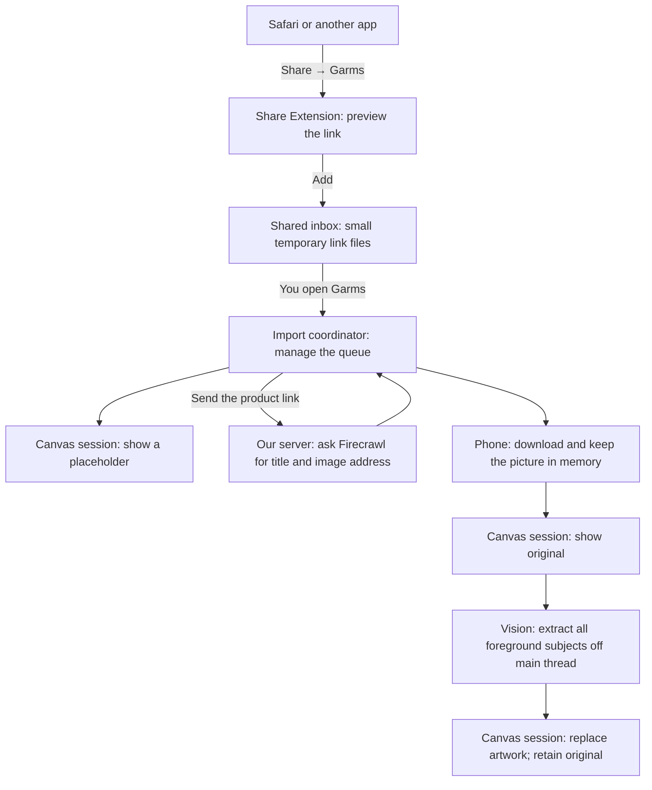

# How shared-link importing works

This change lets you share a product link from another app, save it to a small waiting area, and turn it into a sticker when you open Garms. Garms initially shows a placeholder, then shows the downloaded original and attempts to replace it with a transparent foreground cutout.

There are three places involved: the little Garms window in the iPhone Share Sheet, the main Garms app, and our web server. They each have a different job. The Share Sheet window captures the link. The server reads the product page. The main app manages the queue, downloads the picture, and puts the result on the canvas.

All paths below start at the repository root. **New** means we added the file for this feature. **Changed** means we extended an existing file.

## Follow one link through the system

Imagine sharing a jacket from Safari:

1. **You choose Garms in the Share Sheet.** `ShareViewController.swift` reads what Safari has shared and shows the link with Add and Cancel buttons.
2. **You tap Add.** `SharedImportInbox.swift` writes a small file containing the link. The extension says “Queued — open Garms to finish importing.” It does not open the main app automatically.
3. **You open Garms.** `CanvasScreen.swift` tells `ImportCoordinator.swift` that the app is active. The coordinator checks the waiting area and takes ownership of the saved links.
4. **A placeholder appears.** `CanvasSession.swift` adds a linked sticker near the middle of the current view. It waits for the initial sample layout to finish first.
5. **Garms asks our server about the jacket.** `GarmsAPI.swift` sends the link to `/api/import`. The server uses Firecrawl, a service that reads web pages, to look for a title and a representative picture address.
6. **The phone downloads the picture.** `ImportedAssetLibrary.swift` contains the downloader and keeps the resulting picture in memory. The server returns an image address; it does not send the picture itself in the import response.
7. **The original appears immediately.** `CanvasSession.swift` installs the bounded, orientation-normalised source, using one asset key for both the original and displayed image.
8. **The app removes the background.** `ForegroundCutoutProcessor.swift` runs Vision off the main thread, selects `allInstances`, and generates a cropped PNG with alpha. Whole people and multiple separated subjects remain one sticker.
9. **The cutout replaces the original on the canvas.** The current centre, longest edge and stacking order are preserved after resolving any active interaction. Group proximity is reconciled normally. Product details show labelled Cutout and Original pages, including if the sheet was already open.

If the page or picture cannot be loaded, the placeholder still contains the original link. You can retry from the Imports sheet. Imports are processed one at a time, and processing pauses when Garms becomes inactive. “Removing background…” identifies the extraction stage. No subjects, unusable output or a Vision error keeps the original and finishes Ready with “Background kept”. “Retry background removal” reuses the saved original without repeating network requests. Vision internal errors receive one automatic GPU retry when supported. Logs identify simulator runs; inference failures there should be checked on a physical iPhone.

The coordinator checkpoints the installed original key and aspect, rather than keeping a second image copy. Reactivation resumes from that source. Cancellation waits for any synchronous Vision request to finish before another begins; attempt and placement guards discard stale results after inactivity, deletion or dismissal.

## The Share Sheet and its waiting area

The Share Extension is a small, separate program that iOS runs inside the sharing experience. It cannot simply reach into the main app's memory. The shared inbox is how the two programs pass a link between them.

| File | What it does in plain English |
| --- | --- |
| **New:** `ios/GarmsShare/ShareViewController.swift` | Builds the little sharing window. Reads URL attachments or shared text, shows the detected link, and handles Add, Cancel and Done. Add writes to the inbox. A failed write stays on screen so you can try again. |
| **New:** `ios/GarmsShare/Info.plist` | Tells iOS that this program belongs in the Share Sheet, that it accepts web links and text, and which code opens its window. Think of it as the extension's introduction to iOS. |
| **New:** `ios/SharedImports/SharedImport.swift` | Defines the contents of a saved-link note: a unique ID, URL, optional suggested title and creation time. Also checks links and decides whether two links count as the same. It rejects ambiguous shares with multiple different links and keeps size/colour query parameters intact. |
| **New:** `ios/SharedImports/SharedImportInbox.swift` | Reads and writes the waiting-area files. Each share gets its own file, so sharing a second product cannot overwrite the first. A file is removed after the app has taken responsibility for its link. A broken file can be handled without blocking the others. |
| **New:** `ios/Garms/Garms.entitlements` | Requests permission for the main app to use the shared waiting area. |
| **New:** `ios/GarmsShare/GarmsShare.entitlements` | Requests the matching permission for the extension. Both permissions must name the same App Group: Apple's name for storage that related apps can share. |
| **Changed:** `ios/Garms.xcodeproj/project.pbxproj` | Tells Xcode how to build and package everything. Adds the extension, includes it inside the installed Garms app, gives both programs access to the shared Swift files, and connects their permission files. This is project wiring rather than screen behaviour. |

The two files under `SharedImports` are used by both programs. Keeping them in one place means the extension and the app agree on what a valid saved-link note looks like.

## Managing the work inside Garms

| File | What it does in plain English |
| --- | --- |
| **New:** `ios/Garms/Imports/ImportCoordinator.swift` | Runs the import queue. Reads the inbox, recognises duplicate links, tracks Queued/Processing/Ready/Failed, starts requests, and handles Retry and Dismiss. It also prevents an old network response from bringing back an item you deleted. |
| **Changed:** `ios/Garms/Canvas/CanvasSession.swift` | Owns the current canvas and is the place that actually adds or changes stickers. Now owns the import coordinator and imported pictures too. Adds placeholders, updates titles and artwork, preserves placement, checks that canvas changes are valid, and frees source pictures when they are no longer used. |
| **Changed:** `ios/Garms/Canvas/CanvasScreen.swift` | Connects the feature to the visible app. Checks for shares on opening/returning to Garms, pauses processing when inactive, and shows the Imports button and sheet. Also passes imported pictures to the group drawer and product details. |
| **Changed:** `ios/Garms/App/GarmsAPI.swift` | Handles the phone's conversation with our server. Adds an `importProduct` request alongside the existing availability request, using the same configured server address. Turns server errors into messages the import queue can display. |

The distinction between the coordinator and the session is useful: **the coordinator decides what import work happens next; the session changes the canvas.** The screen provides the buttons and tells them when the app becomes active.

## Reading the product page on the server

| File | What it does in plain English |
| --- | --- |
| **New:** `web/app/api/import/route.ts` | Gives the website a new address that the phone can call: `/api/import`. It is a very small entry point that hands the request to the implementation below. |
| **New:** `web/lib/import-product.ts` | Checks the submitted link, asks Firecrawl to read the page, and chooses a title and image address from the page's sharing information. Returns empty values when suitable metadata is missing. Limits request sizes and provider wait time, rejects local/private destinations, and reports failures. |

“Metadata” here means information a website supplies about its own page, such as the title and preview picture used when someone shares it in a message. The importer uses that information; it does not search every picture on the page and guess which one is the jacket.

The existing `/api/scrape` availability system is separate. This new import request does not wait for the availability classifier, extract a price, or add a database entry. Firecrawl credentials stay on the server.

## Keeping and displaying the pictures

Previously, the canvas knew how to show sample pictures shipped inside the app. Imported pictures arrive later, so every place that displays a product needs to find either kind of picture.

| File | What it does in plain English |
| --- | --- |
| **New:** `ios/Garms/Imports/ImportedAssetLibrary.swift` | Holds imported picture data for the current session and generates the “Saved link” placeholder. Also contains the downloader: accepts HTTPS, checks the response, stops oversized downloads, rejects unsuitable images, and shrinks large pictures to a manageable size. |
| **Changed:** `ios/Garms/Canvas/CanvasAssetStore.swift` | Prepares pictures for drawing and keeps disposable, ready-to-draw copies. Now looks for imported picture data before falling back to bundled samples. The common picture-loading helpers here are also used by details and group thumbnails. |
| **Changed:** `ios/Garms/Canvas/GarmsCanvasView.swift` | Connects the session's imported-picture library to the existing canvas renderer. This is a small wiring change; the gesture system was not redesigned. |
| **Changed:** `ios/Garms/Canvas/CanvasImageDetails.swift` | Lets the product details sheet show an imported picture. Imported products get Cutout and Original pages when extraction succeeds, or one Original page on fallback, instead of the samples' five repeated pages, and their price says “Not available.” It also avoids presenting made-up sample brand/colour details for imports. |
| **Changed:** `ios/Garms/Canvas/CanvasDocument.swift` | Defines what a product and sticker contain. Adds a way to recognise imported products and represent their price as unknown. Samples keep their existing £250 value. Group sums include known prices; the screen labels incomplete sums as a known-price subtotal. |

There are two picture stores for a reason. **The imported asset library keeps originals and cutouts for the session. The asset store keeps convenient drawing copies.** Each product references its displayed asset and optional original asset; cleanup retains their union across products. Successful cutouts receive new keys so drawing tiers and touch masks are rebuilt. If iOS asks Garms to free memory, the drawing copies can be thrown away and recreated from the source picture.

`CanvasRenderer.swift` itself did not need changing. It already asks the asset store for a picture by name. The updated store can now answer that same request using an imported picture.

## Checks and documentation

| File | What it does in plain English |
| --- | --- |
| **New:** `ios/tools/checks/SharedImportChecks.swift` | Exercises link validation, duplicate representations, text extraction, and separate inbox writes/reads/removals without needing to share from Safari. |
| **New:** `ios/tools/checks/ImportSessionChecks.swift` | Exercises the app-side flow using temporary files and pretend server responses. Checks placeholders, duplicates, retries, pausing, deletion during a request, successful updates, and picture recovery after clearing drawing copies. |
| **New:** `ios/tools/checks/run-canvas-check.sh` | A helper command that compiles and runs the canvas checks on an Apple Silicon Mac using Apple's UIKit-compatible Mac Catalyst environment. |
| **New:** `web/lib/import-product.test.ts` | Checks the server's metadata selection, partial results, destination validation, oversized requests and provider errors. These tests do not call the paid scraping service. |
| **Changed:** `README.md` | Explains setup, App Group signing, the phone's server address, how to run checks, tested extraction results and remaining physical-device checks. |
| **Existing plan:** `docs/SHARED_LINK_IMPORT_PLAN.md` | Describes the agreed scope and acceptance scenarios. It is the design brief we implemented, rather than code that runs. |
| **New:** `docs/SHARED_LINK_IMPORT_WALKTHROUGH.md` | This guide: an explanation of how the pieces fit together. |

The new checks passed, along with availability, initial-layout and search checks. The existing magnetic-drag check has a cancellation assertion failure that also occurs with the unchanged HEAD version. The unsigned iOS build passed and includes the extension. Backend tests, TypeScript, lint and the webpack production build passed.

Live extraction returned a title and image address for the Vinted fixture listing. Allbirds returned a title without an image. Those results verify page extraction; sharing from actual Safari and Vinted apps still needs a signed-iPhone test.

## What lasts, and what disappears

Before Garms reads a shared link, its little inbox file stays on disk. After Garms takes ownership, that file is removed. The product, downloaded original, cutout and retry status then live only in the running app's memory. Force quitting loses those consumed imports.

The App Group therefore acts as a temporary handoff, not a saved wardrobe. This matches the agreed prototype scope.

## A useful reading order

Start with `CanvasScreen.swift` to see when the feature runs and what buttons it exposes. Then read `ImportCoordinator.swift` to follow the sequence of work, and `CanvasSession.swift` to see how stickers are inserted and updated. Read `web/lib/import-product.ts` for what happens when the server receives a link. The remaining files support those four.

You may also see changes to `CanvasOverlayView.swift`, `ContentView.swift`, or the `Garms.xcscheme` file in your working tree. Those were separate edits present before or during this work; they are not part of the import implementation described here.

## Background-removal verification

On 26 September 2026, the unsigned iOS 26.2 SDK build compiled the new Vision worker
in the app and embedded the unchanged share extension. Import session, foreground
cutout, initial-layout, search and availability checks passed. Magnetic drag still
fails its existing line 86 cancellation assertion. `ForegroundCutoutChecks.swift`
uses controlled continuations and synthetic alpha-bearing artwork; it tests state,
ownership and rendering boundaries, not Vision detection accuracy. See the README
for commands and device validation status. No backend or share-extension code changed.

A signed Debug smoke run on iPhone 17 Pro / iOS 26.6.2 exercised the production Vision
worker on a person, a shoe, an already-transparent cutout and two separated shoes.
All returned alpha PNGs in 0.120–0.257 seconds per image; retrieved outputs kept both
shoes and their transparent gap. Some source-white edge halos remained. The normal
app was restored after this temporary offline validation build. The README records
individual timings and outstanding manual share-sheet/UI acceptance scenarios.
